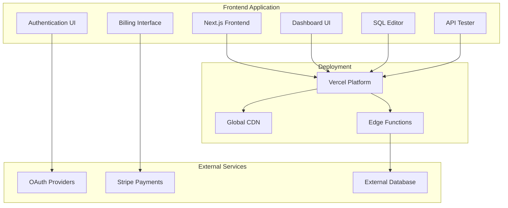
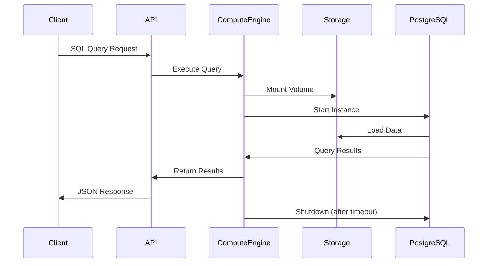
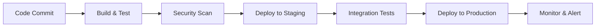

# NebulaDB Frontend Architecture

## System Overview

NebulaDB is a modern frontend interface for database management that provides:
- Complete user interface for database operations
- SQL editor with syntax highlighting
- Real-time dashboard and analytics UI
- Billing and payment interface

## Architecture Diagram

## Component Details

### Frontend Application

#### Next.js Application
- **Technology**: React 18, Next.js 14, TypeScript
- **UI Framework**: TailwindCSS + ShadCN components
- **State Management**: Zustand
- **Authentication**: NextAuth.js
- **Key Features**:
  - User authentication and registration UI
  - Project and database management interface
  - SQL editor with syntax highlighting
  - Real-time monitoring dashboards
  - API testing interface
  - Billing and payment interface
  - Team management interface
  - Settings and configuration panels

#### Component Architecture
- **Pages**: Next.js App Router structure
- **Components**: Reusable UI components with ShadCN
- **Hooks**: Custom React hooks for state management
- **Utils**: Helper functions and utilities
- **Types**: TypeScript type definitions
- **Styles**: TailwindCSS for styling

### External Integrations

#### Authentication Providers
- NextAuth.js integration
- Google OAuth support
- GitHub OAuth support
- Email/password authentication
- Session management

#### Payment Processing
- Stripe integration for billing
- Subscription management interface
- Payment method management
- Invoice generation UI

#### Database Connectivity
- Ready for external database integration
- Connection string management
- Query interface preparation
- Schema visualization components

## Serverless Compute Architecture

### Compute Lifecycle

1. **Cold Start**: Spin up new PostgreSQL instance (~2-3 seconds)
2. **Warm Start**: Reuse existing instance (~100ms)
3. **Auto-scaling**: Scale compute based on query complexity
4. **Auto-shutdown**: Terminate after inactivity (5 minutes default)

## Security Architecture

### Authentication & Authorization
- JWT-based authentication
- Role-based access control (RBAC)
- Row-level security (RLS) in PostgreSQL
- API key management for programmatic access

### Network Security
- TLS encryption for all communications
- VPC isolation for compute instances
- Network policies and firewalls
- DDoS protection and rate limiting

### Data Security
- Encryption at rest (AES-256)
- Encryption in transit (TLS 1.3)
- Regular security audits
- Compliance with SOC 2, GDPR

## Monitoring & Observability

### Metrics Collection
- **Prometheus**: System and application metrics
- **Grafana**: Visualization and alerting
- **Custom Metrics**: Business KPIs and usage patterns

### Logging
- **Structured Logging**: JSON format with correlation IDs
- **Centralized Collection**: ELK stack or similar
- **Log Retention**: Configurable retention policies

### Tracing
- **Distributed Tracing**: OpenTelemetry integration
- **Performance Monitoring**: Query execution times
- **Error Tracking**: Automated error detection and alerting

## Deployment Architecture

### Container Orchestration
- **Kubernetes**: Container orchestration
- **Helm Charts**: Application packaging
- **GitOps**: Automated deployments with ArgoCD

### CI/CD Pipeline

### Infrastructure as Code
- **Terraform**: Infrastructure provisioning
- **Ansible**: Configuration management
- **Docker**: Containerization

## Scalability Considerations

### Horizontal Scaling
- Stateless service design
- Load balancing across multiple instances
- Database sharding strategies
- CDN for static assets

### Performance Optimization
- Connection pooling (PgBouncer)
- Query optimization and indexing
- Caching strategies (Redis, CDN)
- Asynchronous processing for heavy operations

### Cost Optimization
- Auto-scaling based on demand
- Spot instances for non-critical workloads
- Storage tiering (hot/warm/cold)
- Resource usage monitoring and alerts

## Disaster Recovery

### Backup Strategy
- **Automated Backups**: Daily full backups, continuous WAL archiving
- **Cross-Region Replication**: Geographic redundancy
- **Point-in-Time Recovery**: Restore to any point within retention period

### High Availability
- **Multi-AZ Deployment**: Automatic failover
- **Health Checks**: Continuous monitoring and alerting
- **Circuit Breakers**: Graceful degradation during outages

### Business Continuity
- **RTO**: Recovery Time Objective < 4 hours
- **RPO**: Recovery Point Objective < 15 minutes
- **Disaster Recovery Testing**: Regular DR drills