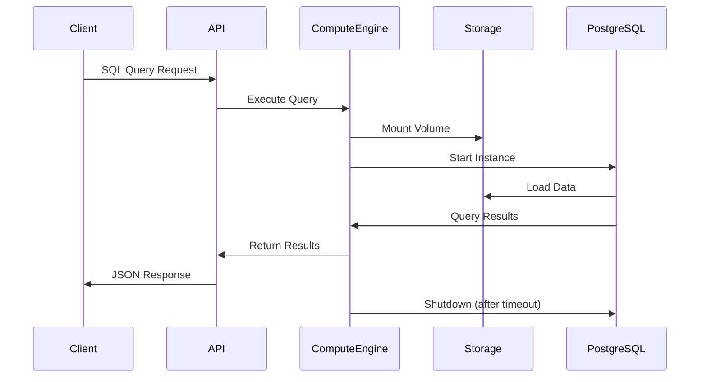
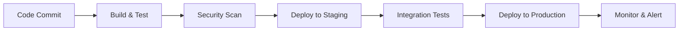

# NebulaDB Architecture

## System Overview

NebulaDB is a serverless PostgreSQL Backend-as-a-Service (BaaS) platform that provides:
- Serverless PostgreSQL databases with auto-scaling compute
- Auto-generated REST APIs from database schemas
- Real-time monitoring and usage analytics
- Pay-as-you-go billing model

## Architecture Diagram

```mermaid
graph TB
    subgraph "Frontend Layer"
        UI[Next.js Frontend]
        Dashboard[Dashboard UI]
        SQLEditor[SQL Editor]
        APITester[API Tester]
    end

    subgraph "API Gateway"
        LB[Load Balancer]
        Auth[Authentication]
        RateLimit[Rate Limiting]
    end

    subgraph "Backend Services"
        MetadataAPI[Metadata API<br/>Go Service]
        ComputeEngine[Compute Engine<br/>Go Service]
        BillingService[Billing Service<br/>Go Service]
        APIGenerator[API Generator<br/>Go Service]
    end

    subgraph "Data Layer"
        MetaDB[(Metadata DB<br/>PostgreSQL)]
        UserDB[(User Databases<br/>Serverless PostgreSQL)]
        ObjectStore[Object Storage<br/>MinIO/S3]
        Cache[(Redis Cache)]
    end

    subgraph "Infrastructure"
        K8s[Kubernetes Cluster]
        Monitoring[Prometheus + Grafana]
        Logging[Centralized Logging]
    end

    UI --> LB
    Dashboard --> LB
    SQLEditor --> LB
    APITester --> LB

    LB --> Auth
    Auth --> RateLimit
    RateLimit --> MetadataAPI
    RateLimit --> ComputeEngine
    RateLimit --> BillingService

    MetadataAPI --> MetaDB
    MetadataAPI --> Cache
    ComputeEngine --> UserDB
    ComputeEngine --> ObjectStore
    BillingService --> MetaDB
    APIGenerator --> UserDB

    K8s --> Backend Services
    Monitoring --> Backend Services
    Logging --> Backend Services
```

## Component Details

### Frontend Layer

#### Next.js Application
- **Technology**: React 18, Next.js 14, TypeScript
- **UI Framework**: TailwindCSS + ShadCN components
- **State Management**: Zustand
- **Key Features**:
  - User authentication and registration
  - Project and database management
  - SQL editor with syntax highlighting
  - Real-time monitoring dashboards
  - API testing interface

### Backend Services

#### 1. Metadata API Service
- **Technology**: Go (Golang)
- **Responsibilities**:
  - User authentication and authorization
  - Project and database lifecycle management
  - Table schema management
  - API endpoint configuration
  - Usage tracking and logging

#### 2. Compute Engine Service
- **Technology**: Go (Golang)
- **Responsibilities**:
  - Serverless PostgreSQL instance management
  - Query execution and result streaming
  - Connection pooling and optimization
  - Auto-scaling based on demand
  - Security sandboxing

#### 3. Billing Service
- **Technology**: Go (Golang)
- **Responsibilities**:
  - Usage metering and aggregation
  - Stripe payment processing
  - Invoice generation
  - Subscription management
  - Cost optimization recommendations

#### 4. API Generator Service
- **Technology**: Go (Golang)
- **Responsibilities**:
  - Dynamic REST API generation from schemas
  - Query optimization and caching
  - Permission enforcement
  - Rate limiting per endpoint
  - API documentation generation

### Data Layer

#### Metadata Database (PostgreSQL)
Stores system metadata including:
- User accounts and authentication
- Projects and team memberships
- Database configurations
- Table schemas and relationships
- API endpoint definitions
- Usage logs and billing data

#### User Databases (Serverless PostgreSQL)
- Ephemeral compute instances
- Persistent storage volumes
- Automatic backup and recovery
- Point-in-time recovery (PITR)
- Connection pooling

#### Object Storage (MinIO/S3)
- Database backups and snapshots
- Large object storage
- Static file hosting
- Log archival

#### Cache Layer (Redis)
- Session management
- Query result caching
- Rate limiting counters
- Real-time metrics

## Serverless Compute Architecture



### Compute Lifecycle

1. **Cold Start**: Spin up new PostgreSQL instance (~2-3 seconds)
2. **Warm Start**: Reuse existing instance (~100ms)
3. **Auto-scaling**: Scale compute based on query complexity
4. **Auto-shutdown**: Terminate after inactivity (5 minutes default)

## Security Architecture

### Authentication & Authorization
- JWT-based authentication
- Role-based access control (RBAC)
- Row-level security (RLS) in PostgreSQL
- API key management for programmatic access

### Network Security
- TLS encryption for all communications
- VPC isolation for compute instances
- Network policies and firewalls
- DDoS protection and rate limiting

### Data Security
- Encryption at rest (AES-256)
- Encryption in transit (TLS 1.3)
- Regular security audits
- Compliance with SOC 2, GDPR

## Monitoring & Observability

### Metrics Collection
- **Prometheus**: System and application metrics
- **Grafana**: Visualization and alerting
- **Custom Metrics**: Business KPIs and usage patterns

### Logging
- **Structured Logging**: JSON format with correlation IDs
- **Centralized Collection**: ELK stack or similar
- **Log Retention**: Configurable retention policies

### Tracing
- **Distributed Tracing**: OpenTelemetry integration
- **Performance Monitoring**: Query execution times
- **Error Tracking**: Automated error detection and alerting

## Deployment Architecture

### Container Orchestration
- **Kubernetes**: Container orchestration
- **Helm Charts**: Application packaging
- **GitOps**: Automated deployments with ArgoCD

### CI/CD Pipeline


### Infrastructure as Code
- **Terraform**: Infrastructure provisioning
- **Ansible**: Configuration management
- **Docker**: Containerization

## Scalability Considerations

### Horizontal Scaling
- Stateless service design
- Load balancing across multiple instances
- Database sharding strategies
- CDN for static assets

### Performance Optimization
- Connection pooling (PgBouncer)
- Query optimization and indexing
- Caching strategies (Redis, CDN)
- Asynchronous processing for heavy operations

### Cost Optimization
- Auto-scaling based on demand
- Spot instances for non-critical workloads
- Storage tiering (hot/warm/cold)
- Resource usage monitoring and alerts

## Disaster Recovery

### Backup Strategy
- **Automated Backups**: Daily full backups, continuous WAL archiving
- **Cross-Region Replication**: Geographic redundancy
- **Point-in-Time Recovery**: Restore to any point within retention period

### High Availability
- **Multi-AZ Deployment**: Automatic failover
- **Health Checks**: Continuous monitoring and alerting
- **Circuit Breakers**: Graceful degradation during outages

### Business Continuity
- **RTO**: Recovery Time Objective < 4 hours
- **RPO**: Recovery Point Objective < 15 minutes
- **Disaster Recovery Testing**: Regular DR drills